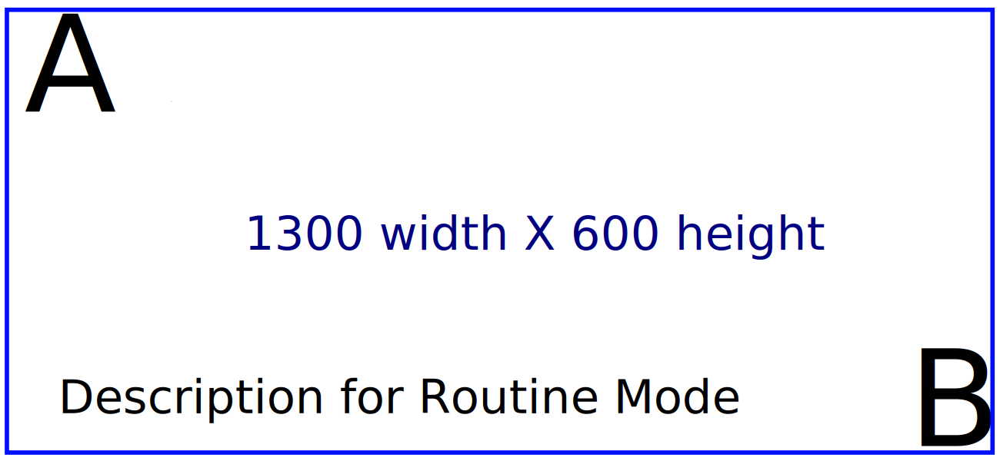

# Real-time AI for surgery with NVIDIA-Holoscan platform
Miguel Xochicale

# 

Real-time
AI for surgery  
with
NVIDIA-Holoscan platform  
  
    
 Miguel Xochicale, PhD  
[
`mxochicale/`](https://github.com/mxochicale/real-time-ai-for-surgery-with-NVIDIA-Holoscan-platform)

2024-04-20 @
[Link for grid-worms-animation
2023](https://github.com/saforem2/grid-worms-animation/)

# Overview

1.  [overview](#sec-ov)
2.  [holoscan-platform](#sec-hp)
3.  [end-to-end-apps](#sec-e2e)
4.  [demos](#sec-demos)
5.  [aob](#sec-aob)

## Template for figures

## Template for tabsets

### Tab A

Content for `Tab A`

### Tab B

Content for `Tab B`

