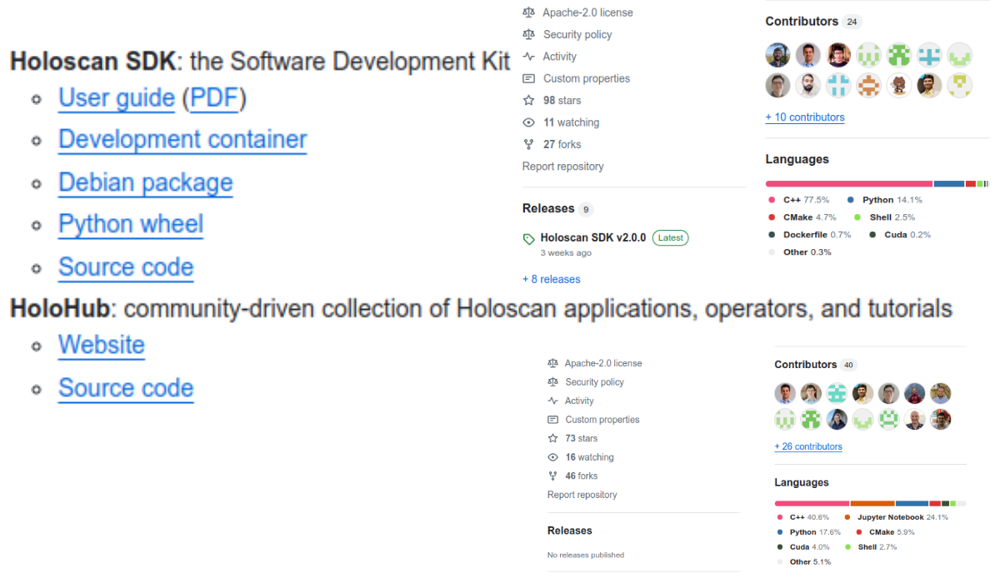
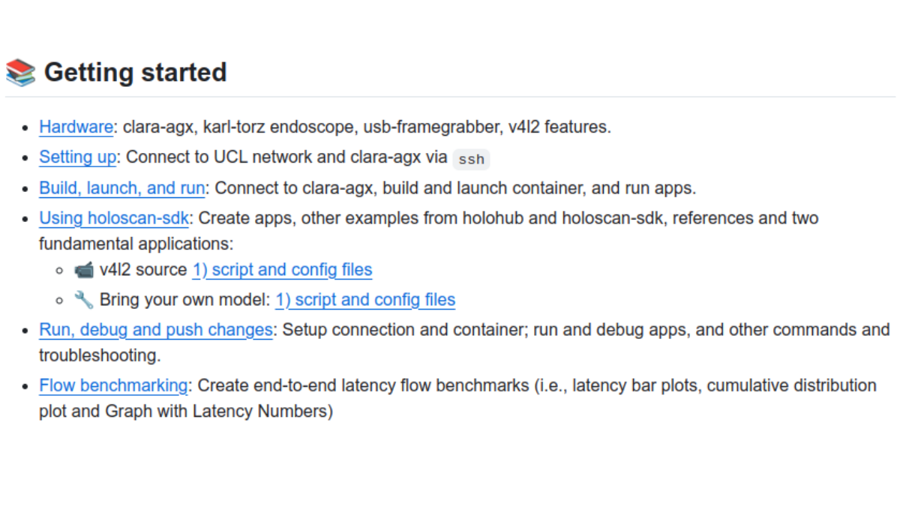
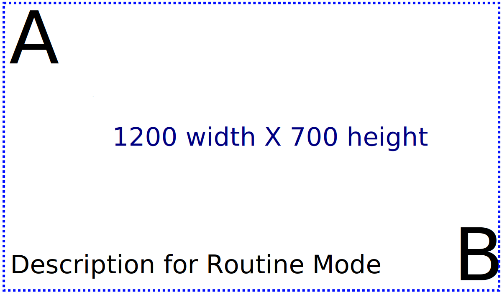

# Real-time AI for surgery with NVIDIA-Holoscan platform
Miguel Xochicale

# 

<div style="background-color: rgba(22,22,22,0.75); border-radius: 10px; text-align:center; padding: 0px; padding-left: 1.5em; padding-right: 1.5em; max-width: min-content; min-width: max-content; margin-left: auto; margin-right: auto; padding-top: 0.2em; padding-bottom: 0.2em; line-height: 1.5em!important;">

<span style="color:#939393; font-size:1.5em; font-weight: bold;">Real-time
AI for surgery</span>  
<span style="color:#939393; font-size:1.5em; font-weight: bold;">with
NVIDIA-Holoscan platform</span>  
<span style="color:#777777; font-size:1.2em; font-weight: normal;">ARC
Collaborations, UCL</span>  
<span style="padding-bottom: 0.5rem;"><br> </span>  
[](http://mxochicale.github.io/) Miguel Xochicale, PhD  
<span style="border-bottom: 0.5px solid #00ccff;">[
`mxochicale`](https://github.com/mxochicale/real-time-ai-for-surgery-with-NVIDIA-Holoscan-platform)</span>

</div>

<div class="footer">

<span class="dim-text" style="&quot;text-align:left;'">2024-04-20 @
[Link for grid-worms-animation
2023](https://github.com/saforem2/grid-worms-animation/)</span>

</div>

<div class="notes">

First slide

</div>

## Content

1.  [My background](#sec-ov)
2.  [Endoscopic Pituitary Tumor Surgery](#sec-surg)
3.  [Holoscan-platform](#sec-hp)
4.  [End-to-end-apps for surgery](#sec-e2e)
5.  [Demos](#sec-demos)
6.  [Event announcement](#sec-aob)

<!--
6. [Acknowledgement](#sec-aob)
-->

<div class="notes">

Content

</div>

## My background


<div class="notes">

My background

</div>

## :medical_symbol: Endoscopic Pituitary Surgery

<https://www.youtube.com/embed/EwlRdxokdGk>

<div class="notes">

94,961 views 20 Nov 2012 Barrow Neurological Institute Neurosurgeon
Andrew S. Little, MD, demonstrates the process of removing a tumor of
the pituitary gland using minimally-invasive endoscopic neurosurgery.
https://www.youtube.com/watch?app=desktop&v=EwlRdxokdGk

553,519 views 28 May 2017 The pituitary gland is located at the bottom
of your brain and above the inside of your nose. Endoscopic pituitary
surgery (also called transsphenoidal endoscopic surgery) is a minimally
invasive surgery performed through the nose and sphenoid sinus to remove
pituitary tumors. https://www.youtube.com/watch?v=lwmgNLwt_ts

Mao, Zhehua, Adrito Das, Mobarakol Islam, Danyal Z. Khan, Simon C.
Williams, John G. Hanrahan, Anouk Borg et al. “PitSurgRT: real-time
localization of critical anatomical structures in endoscopic pituitary
surgery.” International Journal of Computer Assisted Radiology and
Surgery (2024): 1-8.

</div>

## Real-time AI Applications for Surgery


<div class="notes">

Pipeline with development and deployment of real-time AI apps for
surgery

{fig-align=center} {fig-pos=‘b’} b(bottom) h(here) p(page) t(top)

</div>

## NVIDIA Holoscan platform

<div class="columns">

<div class="column" width="50%">

Holoscan-SDK



[
`holoscan-sdk`](https://github.com/nvidia-holoscan/holoscan-sdk/tree/main)

[ `holohub`](https://github.com/nvidia-holoscan/holohub)

</div>

<div class="column" width="50%">

Clara-AGX


[
`Clara-AGX DevKit`](https://github.com/nvidia-holoscan/holoscan-docs/blob/main/devkits/clara-agx/clara_agx_user_guide.md)

[
`Orin-IGX DevKit`](https://github.com/nvidia-holoscan/holoscan-docs/blob/main/devkits/nvidia-igx-orin/nvidia_igx_orin_user_guide.md)

</div>

</div>

<div class="notes">

Holoscan platform

</div>

## Bring Your Own Model (BYOM)

<div class="panel-tabset">

### Workflow


### Python

``` python
import os
from argparse import ArgumentParser

from holoscan.core import Application

from holoscan.operators import (
    FormatConverterOp,
    HolovizOp,
    InferenceOp,
    SegmentationPostprocessorOp,
    VideoStreamReplayerOp,
)
from holoscan.resources import UnboundedAllocator


class BYOMApp(Application):
    def __init__(self, data):
        """Initialize the application

Parameters
----------
data : Location to the data
"""

        super().__init__()

        # set name
        self.name = "BYOM App"

        if data == "none":
            data = os.environ.get("HOLOSCAN_INPUT_PATH", "../data")

        self.sample_data_path = data

        self.model_path = os.path.join(os.path.dirname(__file__), "../model")
        self.model_path_map = {
            "byom_model": os.path.join(self.model_path, "identity_model.onnx"),
        }

        self.video_dir = os.path.join(self.sample_data_path, "racerx")
        if not os.path.exists(self.video_dir):
            raise ValueError(f"Could not find video data:{self.video_dir=}")

# Define the workflow
        self.add_flow(source, viz, {("output", "receivers")})
        self.add_flow(source, preprocessor, {("output", "source_video")})
        self.add_flow(preprocessor, inference, {("tensor", "receivers")})
        self.add_flow(inference, postprocessor, {("transmitter", "in_tensor")})
        self.add_flow(postprocessor, viz, {("out_tensor", "receivers")})


def main(config_file, data):
    app = BYOMApp(data=data)
    # if the --config command line argument was provided, it will override this config_file
    app.config(config_file)
    app.run()


if __name__ == "__main__":
    # Parse args
    parser = ArgumentParser(description="BYOM demo application.")
    parser.add_argument(
        "-d",
        "--data",
        default="none",
        help=("Set the data path"),
    )

    args = parser.parse_args()
    config_file = os.path.join(os.path.dirname(__file__), "byom.yaml")
    main(config_file=config_file, data=args.data)
```

### YAML

``` python
%YAML 1.2
replayer:  # VideoStreamReplayer
  basename: "racerx"
  frame_rate: 0 # as specified in timestamps
  repeat: true # default: false
  realtime: true # default: true
  count: 0 # default: 0 (no frame count restriction)

preprocessor:  # FormatConverter
  out_tensor_name: source_video
  out_dtype: "float32"
  resize_width: 512
  resize_height: 512

inference:  # Inference
  backend: "trt"
  pre_processor_map:
    "byom_model": ["source_video"]
  inference_map:
    "byom_model": ["output"]

postprocessor:  # SegmentationPostprocessor
  in_tensor_name: output
  # network_output_type: None
  data_format: nchw

viz:  # Holoviz
  width: 854
  height: 480
  color_lut: [
    [0.65, 0.81, 0.89, 0.1],
    ]
```

</div>

<div class="notes">

Speaker notes go here.

</div>

##  `real-time-ai-for-surgery`

### Getting started docs



<div class="notes">

Speaker notes go here.

</div>

##  `real-time-ai-for-surgery`

### 🏥 Endoscopic pituitary surgery

<div class="panel-tabset">

### 👃 Multi-head Model


### 🌓 PhaseNet Model


</div>

<div class="notes">

Speaker notes go here.

</div>

##  `real-time-ai-for-surgery`

### 🏥 Endoscopic pituitary surgery

<div class="panel-tabset">

### 🔱 Multi AI models (python)

<div class="code-with-filename">

**multi-ai.py**

``` python

...

        # Define the workflow
        if is_v4l2:
            self.add_flow(source, viz, {("signal", "receivers")})
            self.add_flow(source, preprocessor_v4l2, {("signal", "source_video")})
            self.add_flow(source, preprocessor_phasenet_v4l2, {("signal", "source_video")})
            for op in [preprocessor_v4l2, preprocessor_phasenet_v4l2]:
                self.add_flow(op, multi_ai_inference_v4l2, {("", "receivers")})
            ### connect infereceOp to postprocessors
            self.add_flow(
                multi_ai_inference_v4l2, multiheadOp, {("transmitter", "in_tensor_postproOp")}
            )
            self.add_flow(multi_ai_inference_v4l2, segpostprocessor, {("transmitter", "")})
            self.add_flow(multi_ai_inference_v4l2, phasenetOp, {("", "in")})

        else:
            self.add_flow(source, viz, {("", "receivers")})
            self.add_flow(source, preprocessor_replayer, {("output", "source_video")})
            self.add_flow(source, preprocessor_phasenet_replayer, {("output", "source_video")})
            for op in [preprocessor_replayer, preprocessor_phasenet_replayer]:
                self.add_flow(op, multi_ai_inference_replayer, {("", "receivers")})
            ### connect infereceOp to postprocessors
            self.add_flow(
                multi_ai_inference_replayer, multiheadOp, {("transmitter", "in_tensor_postproOp")}
            )
            self.add_flow(multi_ai_inference_replayer, segpostprocessor, {("transmitter", "")})
            self.add_flow(multi_ai_inference_replayer, phasenetOp, {("", "in")})

        ## connect postprocessors outputs for visualisation with holoviz
        self.add_flow(multiheadOp, viz, {("out_tensor_postproOp", "receivers")})
        self.add_flow(segpostprocessor, viz, {("", "receivers")})
        self.add_flow(phasenetOp, viz, {("out", "receivers")})
        self.add_flow(phasenetOp, viz, {("output_specs", "input_specs")})

...
```

</div>

### 🔱 Multi AI models (YAML)

<div class="code-with-filename">

**multi-ai.yaml**

``` python

...

 multi_ai_inference_v4l2:
  #
  #
  # Multi-AI Inference Operator InferenceOp()
  #
  #
  backend: "trt"
  pre_processor_map:
    "pit_surg_model": ["prepro_v4l2"]
    "phasenet_model": ["prepro_PNv4l2"]
  inference_map:
    "pit_surg_model": ["segmentation_masks", "landmarks"]
    "phasenet_model": ["out"]
  enable_fp16: False
  parallel_inference: true # optional param, default to true
  infer_on_cpu: false # optional param, default to false
  input_on_cuda: true # optional param, default to true
  output_on_cuda: true # optional param, default to true
  transmit_on_cuda: true # optional param, default to true
  is_engine_path: false # optional param, default to false

multi_ai_inference_replayer:
  #
  #
  # Multi-AI Inference Operator InferenceOp()
  #
  #
  backend: "trt"
  pre_processor_map:
    "pit_surg_model": ["prepro_replayer"]
    "phasenet_model": ["prepro_PNreplayer"]
  inference_map:
    "pit_surg_model": ["segmentation_masks", "landmarks"]
    "phasenet_model": ["out"]
  enable_fp16: False
  parallel_inference: true # optional param, default to true
  infer_on_cpu: false # optional param, default to false
  input_on_cuda: true # optional param, default to true
  output_on_cuda: true # optional param, default to true
  transmit_on_cuda: true # optional param, default to true
  is_engine_path: false # optional param, default to false

...
```

</div>

</div>

<div class="notes">

Speaker notes go here.

 \`\`\`{.python
filename=“unit-test-example.py” code-line-numbers=“\|30-36”}

</div>

##  `real-time-ai-for-surgery`

### 🤝 Contributing


<div class="notes">

Speaker notes go here.

</div>

##  `real-time-ai-for-surgery`

### Future work

- Multi-sensor real-time AI
  - Enterprise secondments funding (Results end of May2024)
- Contributions to holoscan applications
- Real-time AI video-based eye movement assessment

<div class="notes">

Speaker notes go here.

</div>

## Template for figures


<div class="notes">

Speaker notes go here.

</div>

## 

## 🙌 Acknowledgements

- Mikael Brudfors and Nadim Daher
  - NVIDIA Healthcare AI
- Steve Thompson
  - Advanced Research Computing Centre (ARC)
- Zhehua Mao, Sophia Bano and Matt Clarkson
  - Wellcome / EPSRC Centre for Interventional and Surgical Sciences
    (WEISS)
